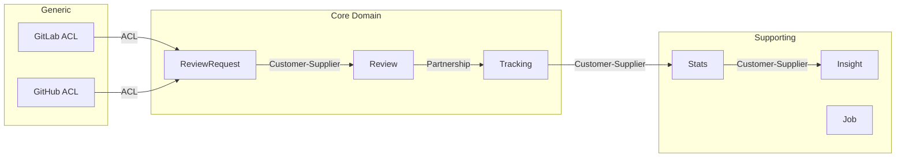

# Event Storming Templates

## Per-BC document: `docs/ddd/event-storming/<bc-name>.md`

```markdown
# Event Storming — [BC Name]

*Date: YYYY-MM-DD*
*Scope: [description of the analyzed perimeter]*

## Domain Events (🟧)

| Event | Trigger | Source file |
|-------|---------|-------------|
| [Past tense: ReviewCompleted, ReviewRequested...] | [Command or system] | [path] |

## Commands / Use Cases (🟦)

| Command | Actor | Event produced | Source file |
|---------|-------|----------------|-------------|
| [Imperative: TriggerReview, CancelReview...] | [user/system/webhook] | [event] | [path] |

## Entities (🟨)

| Entity | Responsibility | Files |
|--------|----------------|-------|
| [Name] | [What it protects/encapsulates] | [paths] |

## Policies and Business Rules (🟪)

| Rule | Description | Source file |
|------|-------------|-------------|
| [Name] | [When and what] | [path] |

## Presenters (🟩)

| Presenter | Data exposed | File |
|-----------|-------------|------|
| [Name] | [What it projects] | [path] |

## Gateways and External Systems (⬜)

| System | Interaction | Gateway contract | Implementation |
|--------|-------------|-----------------|----------------|
| [GitLab API, GitHub API, CLI, filesystem...] | [What is exchanged] | [entities/.../path] | [interface-adapters/.../path] |

## Relations with other Bounded Contexts

| Related BC | Pattern (Vaughn Vernon) | Direction | Detail |
|-----------|------------------------|-----------|--------|
| [Name] | [Partnership/Customer-Supplier/ACL/...] | [→ ← ↔] | [Explanation] |

## Ubiquitous Language

| Term | Definition in this BC | Equivalent term in other BCs |
|------|----------------------|------------------------------|
| [Word] | [Precise meaning here] | [Different meaning elsewhere if applicable] |

## Hot Spots (🩷)

| Problem | Severity | Detail |
|---------|----------|--------|
| [Description] | 🔴/🟠/🟡 | [Explanation + affected files] |
```

## Global document: `docs/ddd/EVENT_STORMING_BIG_PICTURE.md`

This document is **incremental** — each session enriches it without overwriting.

```markdown
# Event Storming Big Picture — ReviewFlow

*Last update: YYYY-MM-DD*

## Identified Bounded Contexts

| BC | Sub-domains | Main entity | Analysis status |
|----|-------------|-------------|-----------------|
| [Name] | [List] | [Name] | ✅ Analyzed / ⏳ To do |

## Context Map (Vaughn Vernon patterns)

[Mermaid diagram of relations between BCs with named patterns]



## Shared Kernel

| Shared element | BCs involved | Stability |
|----------------|-------------|-----------|
| [Type/Module] | [BC list] | 🟢 Stable / 🟡 Evolving / 🔴 Unstable |

## Ubiquitous Language — Global Glossary

| Term | Origin BC | Definition |
|------|----------|------------|
| [Word] | [BC] | [Definition] |

*Full reference: `docs/reference/ubiquitous-language.md`*

## Global Hot Spots

| Problem | Impacted BCs | Severity |
|---------|-------------|----------|
| [Description] | [List] | 🔴/🟠/🟡 |

## Session History

| Date | BC analyzed | Key discoveries |
|------|------------|-----------------|
| YYYY-MM-DD | [Name] | [1-line summary] |
```
