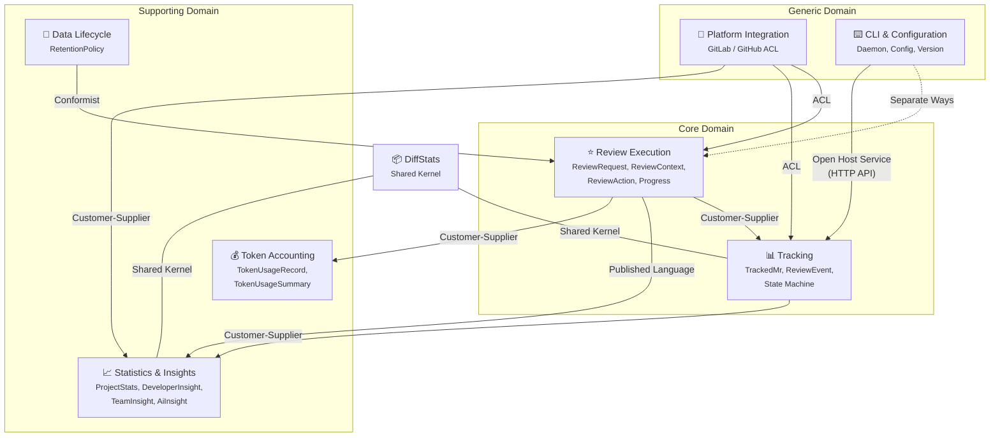
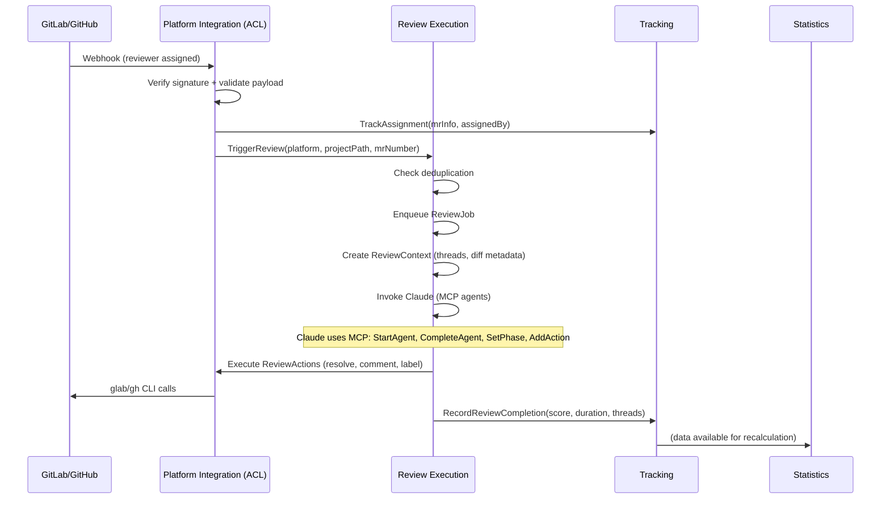
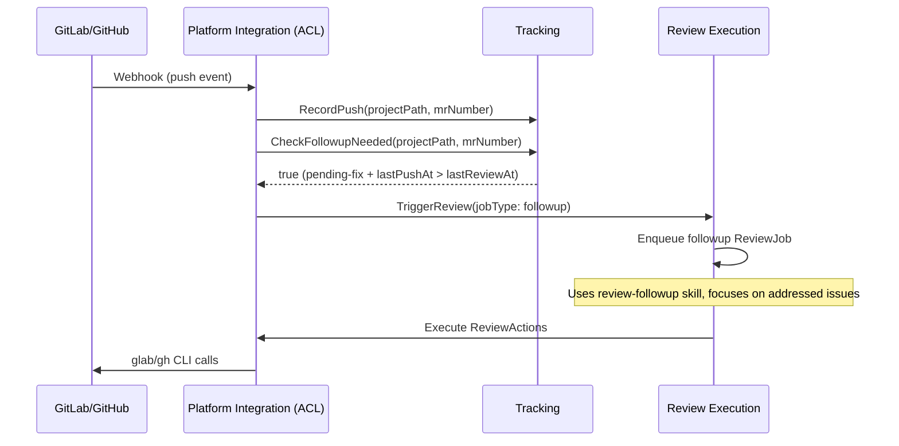
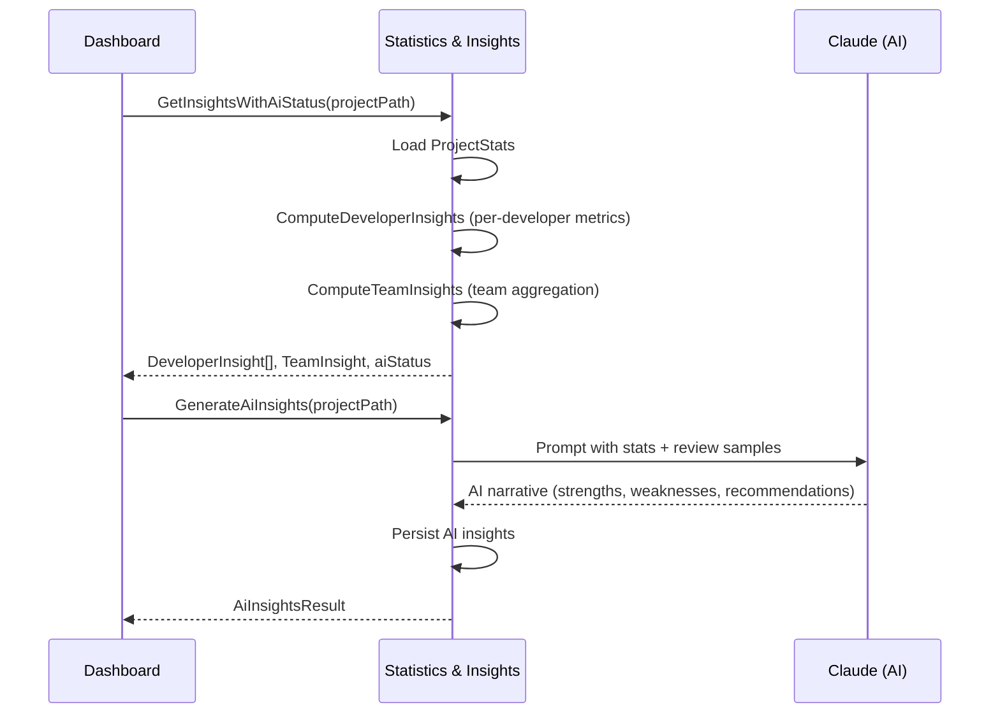

# Event Storming Big Picture — ReviewFlow

*Last update: 2026-05-19*

## Identified Bounded Contexts

| BC | Sub-domains | Main entity | Analysis status |
|----|-------------|-------------|-----------------|
| **Review Execution** | reviewRequest, reviewContext, reviewAction, review, progress, job | ReviewRequest | ✅ Analyzed |
| **Tracking** | tracking | TrackedMr | ✅ Analyzed |
| **Statistics & Insights** | stats, diffStats, backfill, insight | ProjectStats, DeveloperInsight | ✅ Analyzed |
| **Platform Integration** | gitlab, github, diffMetadata, threadFetch | GitLabMergeRequestEvent, GitHubPullRequestEvent | ✅ Analyzed |
| **CLI & Configuration** | packageVersion, mcpSettings, language | PackageVersion | ✅ Analyzed |
| **Data Lifecycle** | cleanup | RetentionPolicy | ✅ Analyzed |
| **Token Accounting** | tokenUsage, tokenUsageSummary | TokenUsageRecord | ✅ Analyzed |

### Domain Classification

| Classification | Bounded Contexts | Rationale |
|----------------|-----------------|-----------|
| **Core Domain** | Review Execution, Tracking | Unique business value — AI-powered code review lifecycle |
| **Supporting Domain** | Statistics & Insights, Data Lifecycle, Token Accounting | Enhances core but could be replaced |
| **Generic Domain** | Platform Integration, CLI & Configuration | Technical plumbing, no business differentiation |

## Context Map (Vaughn Vernon patterns)

### Context Map — Relationship Details

| Upstream BC | Downstream BC | Pattern | Detail |
|-------------|---------------|---------|--------|
| Platform Integration | Review Execution | **Anti-Corruption Layer** | Webhook controllers transform GitLab MergeRequest / GitHub PullRequest events into domain `ReviewRequest`. Creates `ReviewContext`, executes `ReviewAction` via platform CLI. |
| Platform Integration | Tracking | **Anti-Corruption Layer** | Controllers call `TrackAssignment`, `RecordPush`, `TransitionState` with domain-transformed data. |
| Review Execution | Tracking | **Customer-Supplier** | Review supplies completion data (score, duration, threads); Tracking consumes it as `ReviewEvent`. |
| Tracking | Statistics & Insights | **Customer-Supplier** | Tracking provides `TrackedMr` data; Stats aggregates into `ProjectStats`. |
| Review Execution | Statistics & Insights | **Published Language** | `ReviewScore` and review files consumed for analysis. |
| Data Lifecycle | Review Execution | **Conformist** | Cleanup conforms to `ReviewFileGateway` contract owned by Review domain. |
| Platform Integration | Statistics & Insights | **Customer-Supplier** | `DiffStatsFetchGateway` platform-specific implementations used by Stats backfill. |
| CLI & Configuration | Review Execution | **Separate Ways** | CLI manages daemon lifecycle; review execution is independent once server runs. |
| CLI & Configuration | Tracking | **Open Host Service** | `FollowupImportants` CLI command triggers followup via HTTP API. |
| Review Execution | Token Accounting | **Customer-Supplier** | After a `ReviewJob` completes, `claudeInvoker` supplies the `TokenUsage` extracted from the Claude CLI stream and triggers `TrackTokenUsage`. |
| Platform Integration | Token Accounting | **Conformist** | `TokenUsageRecord` embeds `platform`, `projectPath` and `mrNumber` with no ACL. |
| (shared) | Tracking ↔ Stats | **Shared Kernel** | `DiffStats` type from `entities/diffStats/` imported by both. |

## Shared Kernel

| Shared element | BCs involved | Stability |
|----------------|-------------|-----------|
| `DiffStats` type | Statistics & Insights, Tracking | 🟢 Stable — simple data structure (commits, additions, deletions) |
| `Duration` value object | All BCs (via shared/) | 🟢 Stable — utility type with formatting |
| `Language` enum | Review Execution, Statistics & Insights | 🟢 Stable — `'en' \| 'fr'` |
| `ReviewFileGateway` contract | Review Execution, Data Lifecycle, Statistics & Insights | 🟡 Evolving — used by 3 BCs |

## Event Flow — Main Scenarios

### Scenario 1: Initial Review

### Scenario 2: Followup Review

### Scenario 3: Developer Insights

## Ubiquitous Language — Global Glossary

| Term | Origin BC | Definition |
|------|----------|------------|
| ReviewRequest | Review Execution | A request to review code changes; always used instead of MR/PR in domain code |
| ReviewAction | Review Execution | Atomic executable action on a platform (resolve, comment, label) |
| ReviewContext | Review Execution | Session state for one review run (threads, actions, agents, diff metadata) |
| ReviewJob | Review Execution | Queued unit of work representing one review execution |
| ReviewScore | Review Execution | Blocking + warnings + suggestions → severity level |
| FollowupReview | Review Execution | Subsequent review after author pushes fixes |
| Agent | Review Execution | Specialized Claude audit (clean-architecture, ddd, solid, testing, code-quality) |
| TrackedMr | Tracking | Full lifecycle record of a MR/PR being tracked |
| ReviewEvent | Tracking | Record of one review run with metrics |
| ReviewRequestState | Tracking | State machine: pending-review → pending-fix → pending-approval → approved → merged/closed |
| DeveloperInsight | Statistics & Insights | Computed performance profile: title, levels, strengths, trend |
| TeamInsight | Statistics & Insights | Aggregated team performance with actionable tips |
| AiInsight | Statistics & Insights | Claude-generated narrative analysis |
| InsightCategory | Statistics & Insights | Performance dimension: quality, responsiveness, codeVolume, iteration |
| DeveloperTitle | Statistics & Insights | Performance archetype: architect, firefighter, workhorse, sentinel, balanced |
| DiffStats | Shared Kernel | Commit count, additions, deletions, changed files |
| RetentionPolicy | Data Lifecycle | Rule for determining data expiration |
| Thread | Platform Integration | Code comment discussion requiring resolution |
| TokenUsageRecord | Token Accounting | Immutable ledger entry of Claude token consumption and cost for one ReviewJob |
| TokenUsageSummary | Token Accounting | Aggregated token consumption and cost across records, broken down by model |

*Full reference: `docs/reference/ubiquitous-language.md`*

## Global Hot Spots

| Problem | Impacted BCs | Severity | Detail |
|---------|-------------|----------|--------|
| Fat webhook controllers | Platform Integration, Review Execution, Tracking | 🔴 High | GitLab/GitHub controllers orchestrate 6+ use cases, handle context creation, Claude invocation, action execution, stats recording. 400+ lines with too many responsibilities. Should extract orchestration into a dedicated use case. |
| Duplicated controller logic | Platform Integration | 🟠 Medium | GitLab and GitHub controllers share ~60% similar logic (context creation, action execution, stats recording) with no shared abstraction. |
| TrackedMr vs ReviewRequest overlap | Tracking, Review Execution | 🟠 Medium | Both represent a MR/PR but with different shapes and lifecycles. Could lead to concept confusion. |
| Strangler Fig incomplete | Review Execution | 🟡 Low | `reviewContextAction` re-exports from `reviewAction` with "will be removed" comment — migration started but not finished. |
| Direct fs usage in CLI use cases | CLI & Configuration | 🟠 Medium | `writeInitConfig`, `validateConfig`, `addRepositories` use `fs` directly instead of gateway contracts — violates dependency rule. |
| Claude invocation not abstracted | Review Execution, Statistics & Insights | 🟡 Low | Claude invoked via callback in controllers and use cases — no dedicated `ClaudeGateway` contract. |
| No tracking/stats data cleanup | Data Lifecycle, Tracking, Statistics | 🟡 Low | Only review files have retention policy. TrackedMr and ProjectStats grow indefinitely. |
| Large ReviewRequestTrackingGateway | Tracking | 🟡 Low | 12+ methods on a single gateway contract — may benefit from Interface Segregation. |
| DiffStats cross-domain coupling | Tracking, Statistics | 🟡 Low | Shared type creates implicit coupling between two BCs. |
| CLI tool dependency | Platform Integration | 🟠 Medium | All platform interactions depend on `glab`/`gh` CLI tools — no REST API fallback. |
| SummarizeTokenUsage not wired | Token Accounting | 🔴 High | `SummarizeTokenUsageUseCase` has no controller, HTTP route, MCP tool or presenter — the cost-aggregation feature is built but unreachable by any consumer. |
| Token usage ledger never pruned | Token Accounting, Data Lifecycle | 🟡 Low | `.claude/reviews/usage.jsonl` is append-only and grows without bound — not covered by the Data Lifecycle retention policy. |

## Architecture Quality Metrics

| Metric | Value | Assessment |
|--------|-------|------------|
| Cross-domain entity imports | 2 (both `DiffStats`) | 🟢 Excellent — minimal coupling |
| Gateway contracts | 14 | 🟢 Good boundary definition |
| Use cases | 37 | 🟢 Well-decomposed business logic |
| Presenters | 5 | 🟢 Proper separation of concerns |
| Value Objects | 4 (ReviewScore, Duration, RetentionPolicy, ReviewRequestState) | 🟢 Rich domain model |
| Guards (Zod) | 9 | 🟢 Strong boundary validation |

## Session History

| Date | BC analyzed | Key discoveries |
|------|------------|-----------------|
| 2026-03-22 | All (global audit) | 6 BCs identified, 37 use cases, 14 gateway contracts. Main hot spot: fat webhook controllers. Architecture is clean with minimal cross-domain coupling (only DiffStats). Strangler Fig migration in progress on reviewContextAction. |
| 2026-05-19 | Token Accounting | 7th BC identified — cost/token tracking added after the global storming. Supplied by Review Execution (Customer-Supplier). Hot spot: `SummarizeTokenUsage` built but never wired to any consumer. |
