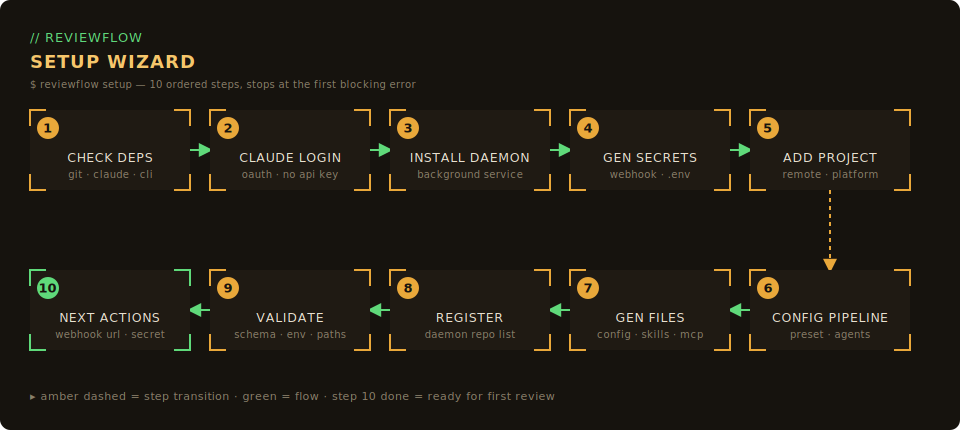

# Quick Start

Get Reviewflow running in 5 minutes.

## Prerequisites

- Node.js 20+
- A GitLab or GitHub account with webhook access
- [Claude Code CLI](https://claude.ai/claude-code) installed and authenticated

## 1. Install

### As a user (recommended)

```bash
npm install -g reviewflow
# or
yarn global add reviewflow
```

You can also run it without installing:

```bash
npx reviewflow start
```

### As a contributor

```bash
git clone https://github.com/DGouron/review-flow.git
cd review-flow
yarn install
yarn build
```

## 2. Initialize

Run the interactive setup wizard:

```bash
reviewflow init
```

The wizard walks you through:
1. Choosing your platform (GitLab, GitHub, or both)
2. Entering your username(s) for @mention filtering
3. Scanning for local repositories to register
4. Generating webhook secrets automatically

Your configuration is saved to your platform config directory — on Linux `~/.config/reviewflow/config.json` and `~/.config/reviewflow/.env` (macOS: `~/Library/Application Support/reviewflow/`, Windows: `%APPDATA%\reviewflow\`). Set `XDG_CONFIG_HOME` to override.

::: tip Non-interactive mode
Use `reviewflow init --yes` to accept all defaults. You can also pass `--scan-path /path/to/projects` to target specific directories.
:::

::: tip Add repositories later
Use `reviewflow discover` to scan for and add new repositories to your existing configuration.
:::

### Full setup wizard

`reviewflow init` only writes configuration. For a guided end-to-end setup that also checks dependencies, signs you into Claude, installs the background daemon, and registers your project, run:

```bash
reviewflow setup
```



The wizard runs ten ordered steps and stops at the first blocking error:

1. **Check dependencies** — verify `git`, `claude`, and the platform CLI (`glab` / `gh`) are installed
2. **Claude login** — confirm an authenticated `claude` session (OAuth, never an API key)
3. **Install daemon** — set up the ReviewFlow background service
4. **Generate secrets** — create webhook secrets and the `.env` file
5. **Add project** — detect the git remote and target platform
6. **Configure pipeline** — pick a review preset (`backend`, `frontend`, `fullstack`, `basic`, or `custom`)
7. **Generate files** — write `.claude/reviews/config.json`, the review skills, and `.mcp.json`
8. **Register project** — add the project to the daemon's repository list
9. **Validate setup** — run final checks across schema, environment, paths, and remotes
10. **Display next actions** — print the webhook URL and secret to finish configuration

| Flag | Purpose |
|------|---------|
| `--path <dir>` | Target project directory (defaults to the current directory) |
| `--json` | Emit a JSON event stream and read answers from stdin (non-interactive) |
| `--force` | Overwrite existing project files (backs up the previous `config.json`) |
| `--yes` | Accept suggested defaults without prompting |
| `--ai` | Enable AI-assisted fallback for ambiguous prompts |
| `--show-secrets` | Print full secret values instead of masking them |

## 3. Configure webhook

### GitLab

1. Go to your project &rarr; **Settings** &rarr; **Webhooks**
2. Add webhook:
   - **URL**: `https://YOUR_TUNNEL_URL/webhooks/gitlab`
   - **Secret token**: (shown during `reviewflow init`, or run `reviewflow init --show-secrets` to view)
   - **Trigger**: &#9745; Merge request events
3. Click **Add webhook**

### GitHub

1. Go to your repo &rarr; **Settings** &rarr; **Webhooks**
2. Add webhook:
   - **Payload URL**: `https://YOUR_TUNNEL_URL/webhooks/github`
   - **Content type**: `application/json`
   - **Secret**: (shown during `reviewflow init`, or run `reviewflow init --show-secrets` to view)
   - **Events**: &#9745; Pull requests
3. Click **Add webhook**

::: info Expose for webhooks
GitLab/GitHub need to reach your server. Use a tunnel:

```bash
# Cloudflare Tunnel (recommended)
cloudflared tunnel --url http://localhost:3847

# Or ngrok
ngrok http 3847
```
:::

## 4. Start & verify

```bash
# Start the server
reviewflow start

# Or as a background daemon
reviewflow start --daemon

# Open the dashboard automatically
reviewflow start --open
```

The server runs at `http://localhost:3847` (or your configured port).

### Verify your setup

```bash
# Check configuration is valid
reviewflow validate

# Check server status
reviewflow status
```

## 5. Test it!

1. Create or open a Merge Request / Pull Request
2. Assign yourself as **Reviewer**
3. Open `http://localhost:3847/dashboard/`
4. Watch the review appear!

::: info Where reviews actually run
On first review of each MR, Reviewflow creates a dedicated git worktree at `~/.reviewflow/worktrees/<platform>-<slug>-<mrNumber>` and dispatches `claude --bg` against it. Your main checkout is never touched. Followups fast-forward the existing worktree; merge/close removes it; a daily sweep reclaims anything stale. See [Worktree Lifecycle](../architecture/worktree-lifecycle.md).
:::

## Next steps

- [Project Configuration](./project-config.md) - Configure review skills per project
- [Deployment Guide](../deployment/index.md) - Run in production with systemd
- [Architecture](../architecture/current.md) - Understand the codebase
- [Worktree Lifecycle](../architecture/worktree-lifecycle.md) - How review isolation works

## Troubleshooting

See [Troubleshooting](./troubleshooting.md) for common issues and CLI diagnostics.
